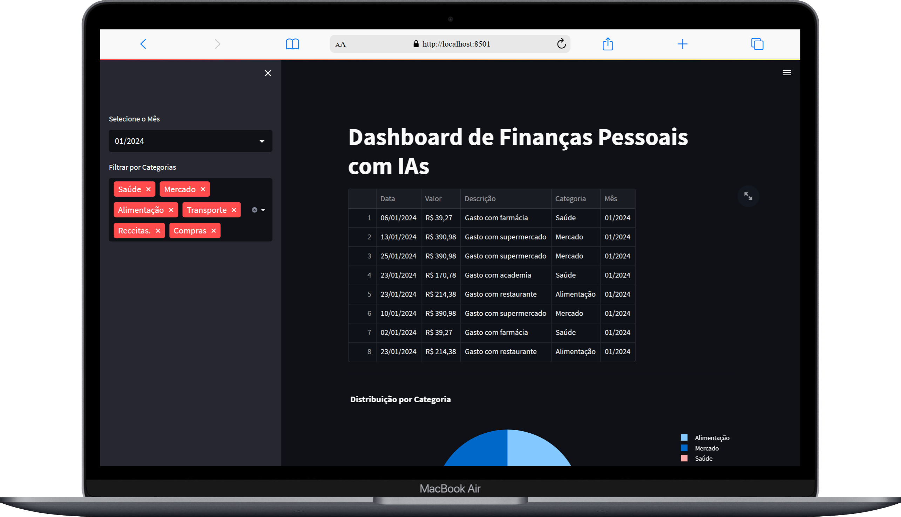
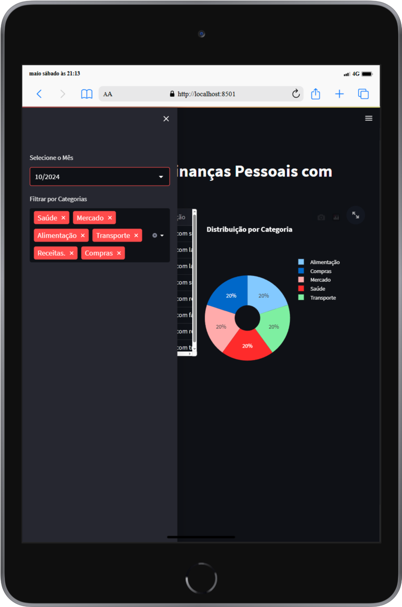

# App - Dashboard de Finanças Pessoais com IAs

## Descrição
Este projeto foi feito para melhorar minhas habilidades como desenvolvedor fullstack, usando na prática algumas tecnologias que já conheço.<br>
Ele foi inspirado em um vídeo da Asimov Academy no YouTube, onde eles mostram como usar IA para analisar finanças pessoais com ChatGPT, Groq, modelos locais (LLMs) e Python.<br>
Você pode assistir o vídeo aqui:<br>
[Coloquei uma IA para analisar minhas FINANÇAS PESSOAIS (usando ChatGPT, LLMs Locais e Python)](https://www.youtube.com/watch?v=bsCImqUjQ74&t=2s)

## O que é o App - Dashboard de Finanças Pessoais com IAs?
É uma dashboard voltada para a análise de dados de finanças pessoais. Você poderá filtrar por dia e mês, categorias e visualizar essas informações.

## Aviso sobre os arquivos `.ofx`
Os arquivos com extensão `.ofx` na pasta `extrato` contêm dados fictícios.  
Esses dados foram gerados por inteligência artificial exclusivamente para fins de teste e demonstração do projeto, e **não correspondem a informações reais**.

## Objetivos:
- Mostrar minhas habilidades técnicas com Streamlit, Python, Pandas, Plotly, ofxparse, IAs, dotenv e mais.
- Aplicar princípios de Clean Code, organização de pastas e mais.
- Ajudar iniciantes com códigos simples, legíveis e prontos para estudo.
- Apresentar meu estilo de trabalho para recrutadores e empresas de tecnologia.

## Funcionalidades
- [x] Sidebar com alguns filtros de MÊS/ANO e Categorias de cada lançamento financeiro.
- [x] Layout responsivo para Desktop, Tablet e Mobile.

## Tecnologias Utilizadas
- Python: Linguagem de programação principal utilizada para desenvolvimento do frontend/backend e manipulação de dados.
- Streamlit: Framework em Python para criação de aplicações web interativas e voltadas à visualização de dados.
- Plotly: Biblioteca interativa de visualização de dados em gráficos para Python.
- Pandas: Biblioteca Python para análise e manipulação de dados, especialmente em estruturas como DataFrames.
- dotenv: Biblioteca Python usada para carregar variáveis de ambiente a partir de arquivos .env, facilitando a configuração segura de credenciais e conexões.
- ofxparse: Biblioteca Python para ler e analisar arquivos OFX (Open Financial Exchange), que são usados para trocar dados financeiros, como extratos bancários e transações.
- ChatGPT e Groq: Modelos de IA que processam linguagem natural para entender, gerar e classificar texto, automatizando análises e interações em dados e finanças.

## 📸 Screenshots
<div align="center">
  <h3>Versão para Desktop</h3>
  
</div>
<br>

<div align="center">
  <h3>Versão para Tablet</h3>
  
</div>
<br>

<div align="center">
  <h3>Versão para Mobile</h3>
  
</div>

##  Como rodar o projeto localmente
## Clone o repositório
```bash
git clone https://github.com/jcddsj01/app-dashboard-financas-pessoais
```

## Acesse a pasta do projeto
```bash
cd app-dashboard-financas-pessoais
```

## Crie um ambiente virtual
Sistema Windows (cmd)
```bash
python -m venv nome-ambiente
```
Sistema Linux
```bash
python3 -m venv nome-ambiente
```

## Ativar o ambiente virtual
Sistema Windows (cmd)
```bash
nome-ambiente\Scripts\activate
```
Sistema Linux
```bash
source nome-ambiente/bin/activate
```

## Instale as dependências 
Sistema Windows (cmd) e Linux
```bash
pip install -r requirements.txt
```

## Inicie o servidor Streamlit
```bash
streamlit run dashboard.py
```

## 📁 Estrutura de Pastas
📦extratos<br>
📦public<br>
 ┗ 📂screenshots<br>

## Deploy (Frontend)
O projeto está disponível online no Streamlit Community Cloud:
https://app-dashboard-financas-peappais-jdkh2pu66rb588qupnxrln.streamlit.app/

Para conhecer o Streamlit Community Cloud -> https://streamlit.io/cloud

## Contato
Sinta-se à vontade para me contatar através dos links abaixo:<br>
E-mail - jcddsj01@outlook.com<br>
Linkedin - https://www.linkedin.com/in/jose-carlos-703821254/

## Licença<br>
MIT License. Você pode usar este projeto como referência para criar o seu próprio portfólio.

---

# App - AI-Powered Personal Finance Dashboard

## Description
This project was made to improve my skills as a fullstack developer, using in practice some technologies that I already know.<br>
It was inspired by a video from Asimov Academy on YouTube, where they show how to use AI to analyze personal finances with ChatGPT, Groq, local models (LLMs) and Python.<br>
You can watch the video here:<br>
[Coloquei uma IA para analisar minhas FINANÇAS PESSOAIS (usando ChatGPT, LLMs Locais e Python)](https://www.youtube.com/watch?v=bsCImqUjQ74&t=2s)

## What is the App - Personal Finance Dashboard with AIs?
It is a dashboard focused on analyzing personal finance data. You can filter by day and month, categories and view this information.

## Notice about `.ofx` files
Files with the `.ofx` extension in the `extract` folder contain fictitious data.
This data was generated by artificial intelligence exclusively for testing and demonstration purposes of the project, and **does not correspond to real information**.

## Objectives:
- Show my technical skills with Streamlit, Python, Pandas, Plotly, ofxparse, IAs, dotenv and more.
- Apply Clean Code principles, folder organization and more.
- Help beginners with simple, readable and study-ready codes.
- Present my work style to recruiters and technology companies.

## Features
- [x] Sidebar with some YEAR/MONTH filters and Categories for each financial release.
- [x] Responsive layout for Desktop, Tablet and Mobile.

## Technologies Used
- Python: Main programming language used for frontend/backend development and data manipulation.
- Streamlit: Python framework for creating interactive web applications focused on data visualization.
- Plotly: Interactive data visualization library in graphs for Python.
- Pandas: Python library for data analysis and manipulation, especially in structures such as DataFrames.
- dotenv: Python library used to load environment variables from .env files, facilitating the secure configuration of credentials and connections.
- ofxparse: Python library for reading and parsing OFX (Open Financial Exchange) files, which are used to exchange financial data, such as bank statements and transactions.
- ChatGPT and Groq: AI models that process natural language to understand, generate and classify text, automating analysis and interactions in data and finance.

## 📸 Screenshots
<div align="center">
  <h3>Desktop version</h3>
  
</div>
<br>

<div align="center">
  <h3>Tablet version</h3>
  
</div>
<br>

<div align="center">
  <h3>Mobile version</h3>
  
</div>

## How to run the project locally
## Clone the repository
```bash
git clone https://github.com/jcddsj01/app-dashboard-financas-pessoais
```

## Access the project folder
```bash
cd app-dashboard-financas-pessoais
```

## Create a virtual environment
Windows system (cmd)
```bash
python -m venv name-environment
```
Sistema Linux
```bash
python3 -m venv name-environment
```

## Activate the virtual environment
Windows system (cmd)
```bash
name-environment\Scripts\activate
```
Linux system
```bash
source name-environment/bin/activate
```

## Install the dependencies 
Windows (cmd) and Linux systems
```bash
pip install -r requirements.txt
```

## Start the Streamlit server
```bash
streamlit run dashboard.py
```

## 📁 Folder Structure
📦extratos<br>
📦public<br>
 ┗ 📂screenshots<br>

## Deploy (Frontend)
The project is available online on the Streamlit Community Cloud:
https://app-dashboard-financas-peappais-jdkh2pu66rb588qupnxrln.streamlit.app/

To learn more about the Streamlit Community Cloud -> https://streamlit.io/cloud

## Contact me
Feel free to contact me via the links below:<br>
E-mail - jcddsj01@outlook.com<br>
Linkedin - https://www.linkedin.com/in/jose-carlos-703821254/

## License<br>
MIT License. You can use this project as a reference to create your own portfolio.
